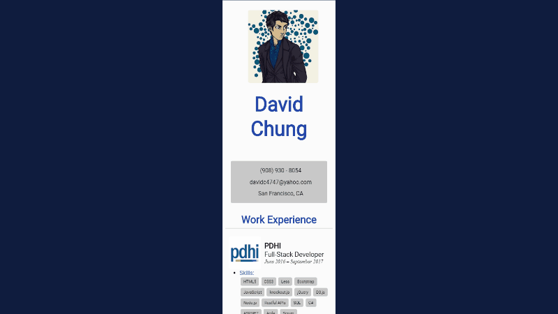

# Responsive Gif &middot; [](https://www.paypal.me/davidc4747) [](https://github.com/davidc4747/responsive-gif) [](https://github.com/davidc4747/responsive-gif/pulls)


Creates a gif that lets you show off or analyze your responsive design.


## Demo

<!--  -->


## Example Output


  


## Installation

```shell
git clone https://github.com/davidc4747/responsive-gif
cd responsive-gif/
npm install
npm run pack

# A package of the project will be created inside the "package/" folder
# An executable file for your operating system will be inside

```

## Developing

### Built With
JavaScript & Electron & [jsGif](https://github.com/antimatter15/jsgif)

### Prerequisites
What is needed to set up the dev environment:  
[Node.js](https://nodejs.org/en/)  
[Git](https://git-scm.com/)

### Setting up Dev

What a developer must do in order to start developing:

```shell
git clone https://github.com/davidc4747/responsive-gif
cd responsive-gif/
npm install
npm run start
```